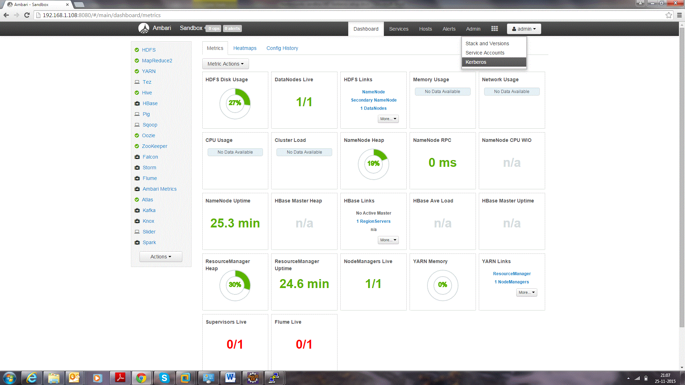
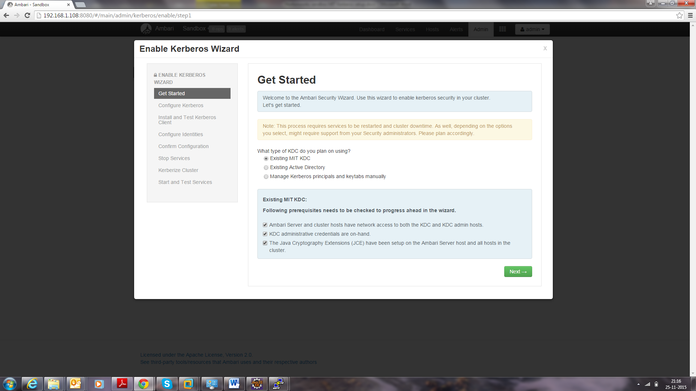
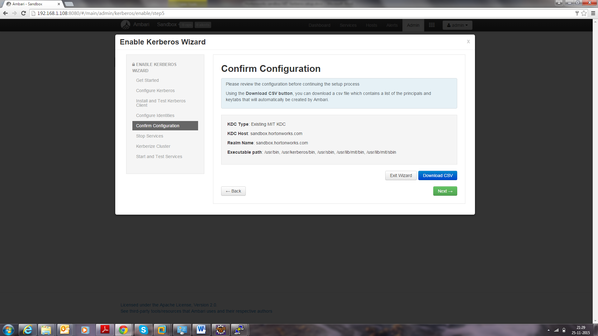

= Kerberos Installation Guide
Think Big Analytics
June 2016

:toc:
:toclevels: 2
:toc-title: Contents

== Pre-requisite

=== Java 

All client node should have java installed  on it.

    $ java version "1.7.0_80"
    $ Java(TM) SE Runtime Environment (build 1.7.0_80-b15)
    $ Java HotSpot(TM) 64-Bit Server VM (build 24.80-b11, mixed mode)

    $ echo $JAVA_HOME
    $ /usr/java/jdk1.7.0_80

	
=== Install Java Cryptography Extensions (JCE) 

    sudo wget -nv --no-check-certificate --no-cookies --header "Cookie: oraclelicense=accept-securebackup-cookie" http://download.oracle.com/otn-pub/java/jce/7/UnlimitedJCEPolicyJDK7.zip -O /usr/java/jdk1.7.0_80/jre/lib/security/UnlimitedJCEPolicyJDK7.zip
	
    cd /usr/java/jdk1.7.0_80/jre/lib/security
	
    sudo unzip UnlimitedJCEPolicyJDK7.zip
	
    sudo cp UnlimitedJCEPolicy/* .
	
    #sudo rm -r UnlimitedJCEPolicy*
	
    ls -l
    
== Install Kerberos

On Cluser , go to master node for installation of Kerberos utils.

1. Install a new version of the KDC server: 

    yum install krb5-server krb5-libs krb5-workstation
    
2. Using a text editor, open the KDC server configuration file, located by default here:

    vi /etc/krb5.conf

3. Change the [realms] as below where the sandbox.hortonworks.com is the domain name.
    
    [logging]
     default = FILE:/var/log/krb5libs.log
     kdc = FILE:/var/log/krb5kdc.log
     admin_server = FILE:/var/log/kadmind.log
    
    [libdefaults]
     default_realm = sandbox.hortonworks.com
     dns_lookup_realm = false
     dns_lookup_kdc = false
     ticket_lifetime = 24h
     renew_lifetime = 7d
     forwardable = true
    
    [realms]
     HDP-TBRND-DEV = {
      kdc = HDP-TBRND-DEV.us.west2.compute.internal
      admin_server = HDP-TBRND-DEV.us.west2.compute.internal
     }
            

4. Create the Kerberos Database. Use the utility kdb5_util to create the Kerberos database. While asking for password , enter password as thinkbig. 
    
    kdb5_util create -s

	
5. Start the KDC. Start the KDC server and the KDC admin server. 

    /etc/rc.d/init.d/krb5kdc start
    /etc/rc.d/init.d/kadmin start
    
6. When installing and managing your own MIT KDC, it is very important to set
up the KDC server to auto-start on boot. 

    chkconfig krb5kdc on
    chkconfig kadmin on

7. Create a KDC admin by creating an admin principal. While asking for password , enter password as thinkbig. 

    kadmin.local -q "addprinc admin/admin"
    
8. Confirm that this admin principal has permissions in the KDC ACL. Using a text editor, open the KDC ACL file:
    
    vi /var/kerberos/krb5kdc/kadm5.acl

9. Ensure that the KDC ACL file includes an entry so to allow the admin principal to administer the KDC for your specific realm. The file should have an entry:
    */HDP-TBRND-DEV *

10. After editing and saving the kadm5.acl file, you must restart the kadmin process.
    
    /etc/rc.d/init.d/kadmin restart

11. Create a user in the linux by typing below. We will use this user to test whether the Kerberos authentication is working or not. We will first run the command “hadoop fs –ls /” but switching to this user. And we will run the same command again when we enable Kerberos. 

    adduser testUser

    su testUser

    hadoop fs –ls /

12. Open Ambari and go to admin tab and select Kerberos. 

13.Click on enable Kerberos. Then following screen will appear check all the things as appear. Click next.

14. Put sandbox.hortonworks.com in KDC tab and click test KDC connection. Then in Kadmin again put HDP-TBRND-DEV as host and admin principal as admin/admin@HDP-TBRND-DEV and give the password as exactly created in step 7. Leave the advanced Kerberos-env and advanced krb5-conf as it is. And click next.

image::images/3.png[]

15. Downlaod csv and save it. 

16. Then do next till end. Finally click on complete.

image::images/5.png[]

Make sure all services started properly. Kerberos is sucessfully installed on cluster.
