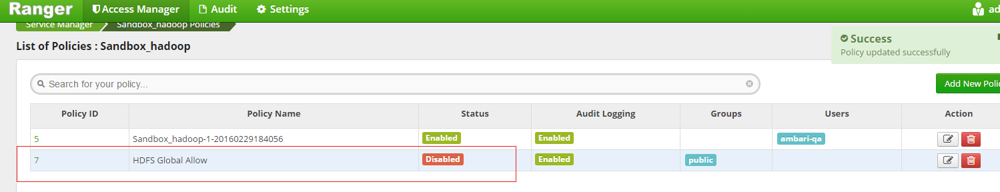
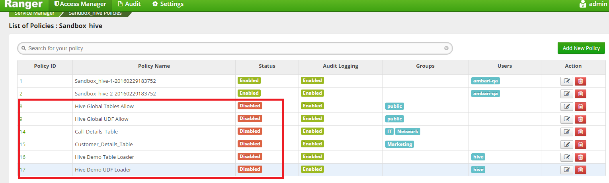
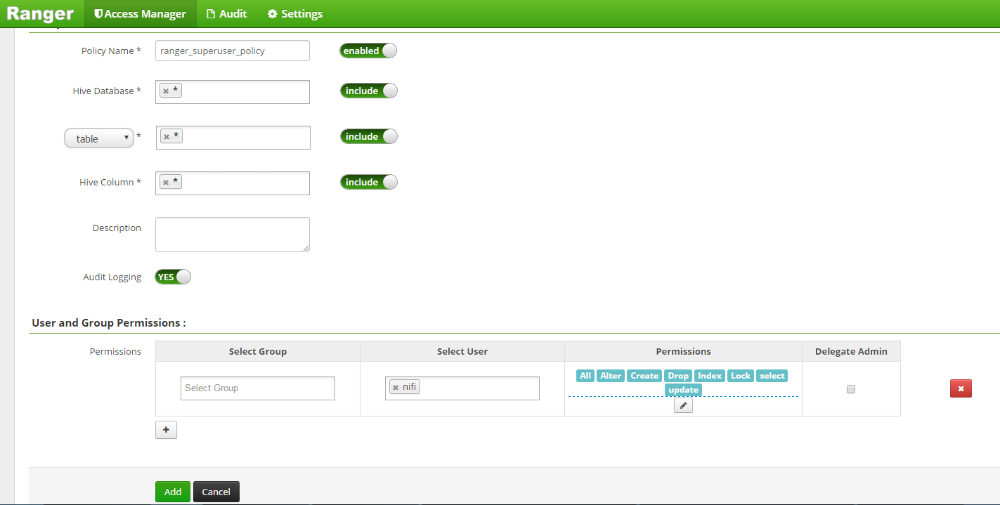
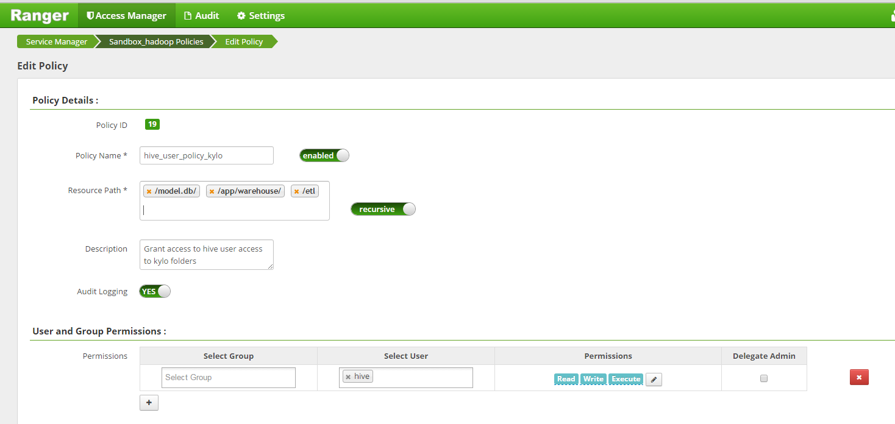
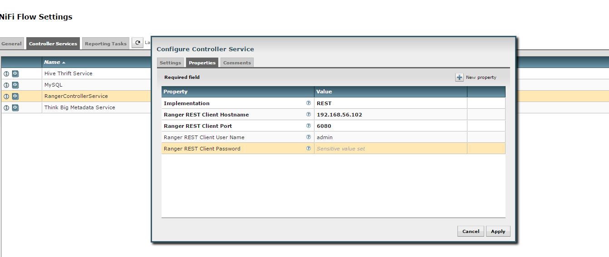
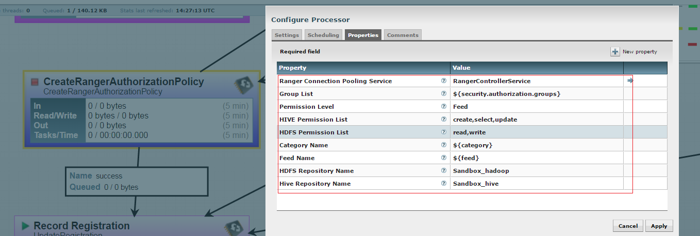

= Enable Ranger Authorization Guide
Think Big Analytics
September 2016

:toc:
:toclevels: 2
:toc-title: Contents

== Pre-requisite

=== Java 

All client node should have java installed  on it.
	
	$ java -version
    $ java version "1.8.0_92"
	$ OpenJDK Runtime Environment (rhel-2.6.4.0.el6_7-x86_64 u95-b00)
    $ OpenJDK 64-Bit Server VM (build 24.95-b01, mixed mode)

    $ echo $JAVA_HOME
    $ /opt/java/jdk1.8.0_92/

=== PCNG is installed.	
This documenation assumes that you have PCNG installed and running on cluster.	
	
=== Optional : Delete/Disable HDFS/HIVE Global Policy. 
If your are using HDP sandbox then remove all HDFS/HIVE global policy.

Disable HDFS Policy. 

Disable HIVE policy

=== Create NIFI Super User Policy in Hive.
* Login to Ranger UI
* Select Hive Repository.
* Click on Add Policy.
* Create policy as shown in image below.

=== Create hive user policy in HDFS repository.
* Login to Ranger UI
* Select HDFS Repository.
* Click on Add Policy.
* Create policy as shown in image below.

=== Configure Ranger Controller Service.

* Go to NIFI UI.
* Click on controller setting.
* Click on (+) sign and add RangerControllerSerive.
* Update RangerControllerSerive property and enable it.

=== Configure CreataRangerAuthorizationPolicy processor

* Go to NIFI
* Select resusable template.
* Select CreataRangerAuthorizationPolicy processor.
* Update property descriptor as per cluster.

Ranger authorization is configured successfully. Now create a feed from ThinkBig UI and create feed for testing.

