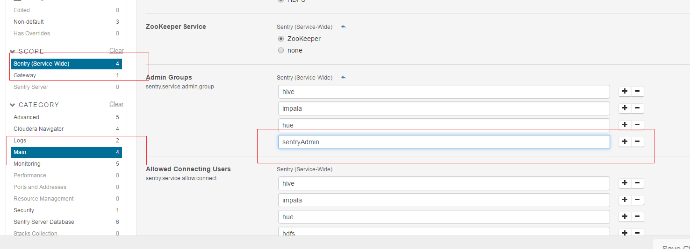
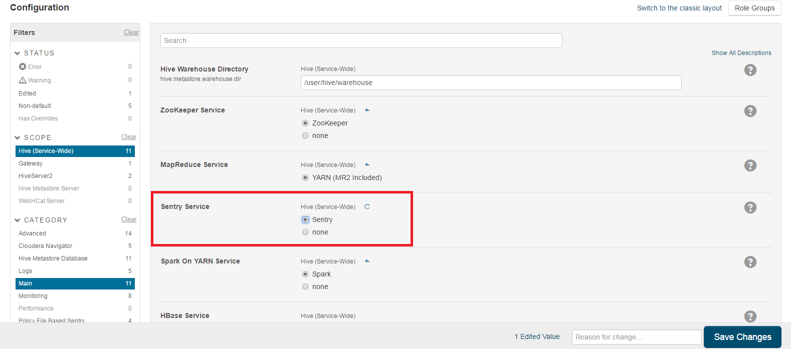
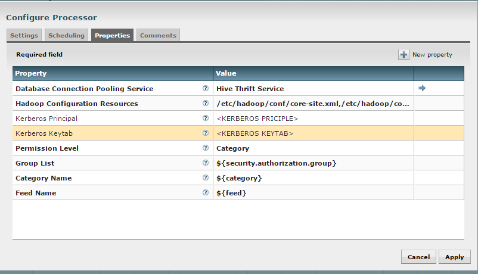

= Enable Sentry Authorization Guide
Think Big Analytics
September 2016

:toc:
:toclevels: 2
:toc-title: Contents

== Pre-requisite

=== Java 

All client node should have java installed  on it.
	
	$ java -version
    $ java version "1.8.0_92"
	$ OpenJDK Runtime Environment (rhel-2.6.4.0.el6_7-x86_64 u95-b00)
    $ OpenJDK 64-Bit Server VM (build 24.95-b01, mixed mode)

    $ echo $JAVA_HOME
    $ /opt/java/jdk1.8.0_92/

	
=== Cluster Requirements 	
* This documenation assumes that you have Kylo installed and running on cluster.	
* Kerberos is mandatory. For testing purpose we can set sentry.hive.testing.mode to true.
* It works with Only Hive Server2.
* In order to define policy for role, you should have user-group created on all node of cluster and then map each role to user-group.
* Only Sentry Admin can grant all access (create role,grant,revoke) to user. You can add normal user to Sentry admin group via Cloudera Manager.

=== Grant Sentry Admin Access to NiFi User

* Create sentryAdmin group and assign nifi user to it.

	groupadd sentryAdmin
	usermod -a -G sentryAdmin nifi

* Add sentryAdmin group to Sentry Admin List

*** Log in to Cloudera Manager
*** Select Sentry Service
*** Go to  Configuration  tab.
*** Select Sentry(Service-Wide) from Scope
*** Select Main from Category
*** Look for sentry.service.admin.group property.
*** Add sentryAdmin to list.
*** Click on Save and Restart Service

== Enabling Sentry for Hive

=== Change Hive warehouse ownership

The Hive warehouse directory (/user/hive/warehouse or any path you specify as hive.metastore.warehouse.dir in your hive-site.xml) must be owned by the Hive user and group.

	$ sudo -u hdfs hdfs dfs -chmod -R 771 /user/hive/warehouse
	$ sudo -u hdfs hdfs dfs -chown -R hive:hive /user/hive/warehouse

If you have Kerberos enabled cluster.

	sudo -u hdfs kinit -kt <hdfs.keytab> hdfs
	sudo -u hdfs hdfs dfs -chmod -R 771 /user/hive/warehouse
	$ sudo -u hdfs hdfs dfs -chown -R hive:hive /user/hive/warehouse
	
=== Disable impersonation for HiveServer2

* Go to the Hive service.
* Click the Configuration tab.
* Select Scope > HiveServer2.
* Select Category > Main.
* Uncheck the HiveServer2 Enable Impersonation checkbox.
* Click Save Changes to commit the changes.

=== Yarn Setting For Hive User

* Open the Cloudera Manager Admin Console and go to the YARN service.
* Click the Configuration tab.
* Select Scope > NodeManager.
* Select Category > Security.
* Ensure the Allowed System Users property includes the hive user. If not, add hive.
* Click Save Changes to commit the changes.
* Repeat steps 1-6 for every NodeManager role group for the YARN service that is associated with Hive.
* Restart the YARN service.

=== Enabled Sentry

* Go to the Hive service.
* Click the Configuration tab.
* Select Scope > Hive (Service-Wide).
* Select Category > Main.
* Locate the Sentry Service property and select Sentry.
* Click Save Changes to commit the changes.
* Restart the Hive service.

== Enabled HDFS ACL

* Go to the Cloudera Manager Admin Console and navigate to the HDFS service.
* Click the Configuration tab.
* Select Scope > HDFS-1 (Service-Wide).
* Select Category > Security.
* Locate the Enable Access Control Lists property and select its checkbox to enable HDFS ACLs.
* Click Save Changes to commit the changes.

image::images/S3.png[]

== Configure CreataSentryAuthorizationPolicy processor

* Go to NIFI
* Select resusable template.
* Select CreataSentryAuthorizationPolicy processor.
* Update property descriptor as per cluster.

	Hadoop Configuration Resources : /etc/hadoop/conf/core-site.xml,/etc/hadoop/conf/hdfs-site.xml
	Kerberos Principle : nifi
	Kerberos Keytab : /etc/security/nifi.headleass.keytab

	
	
Sentry authorization is configured successfully. Now create a feed from ThinkBig UI and test it.
