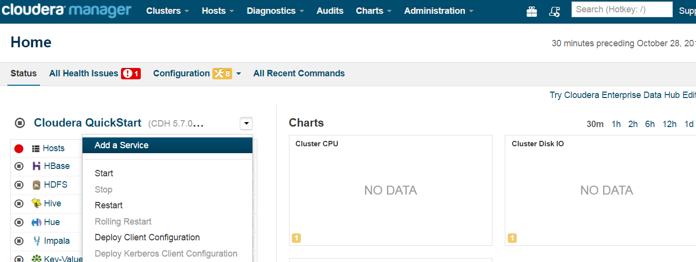
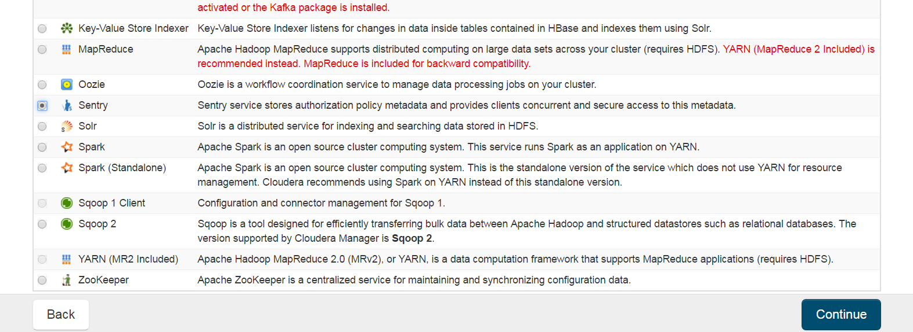
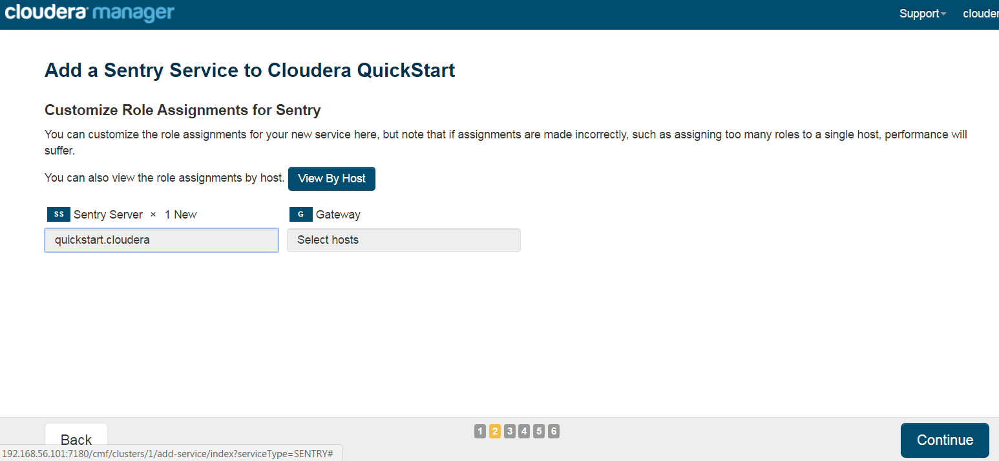
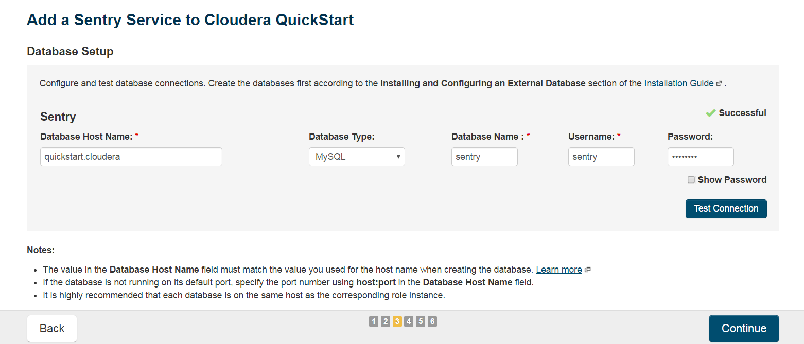
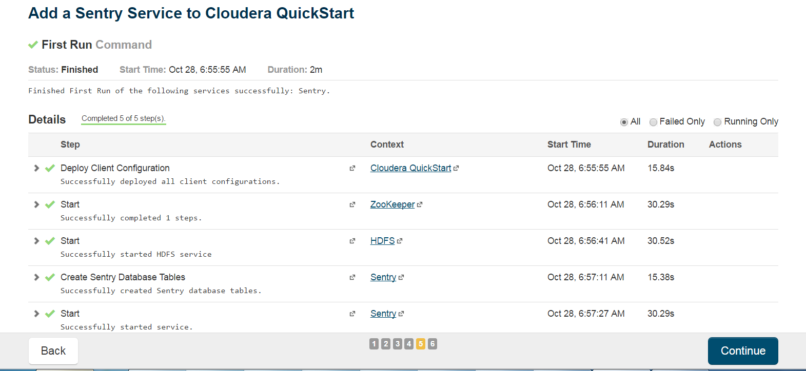
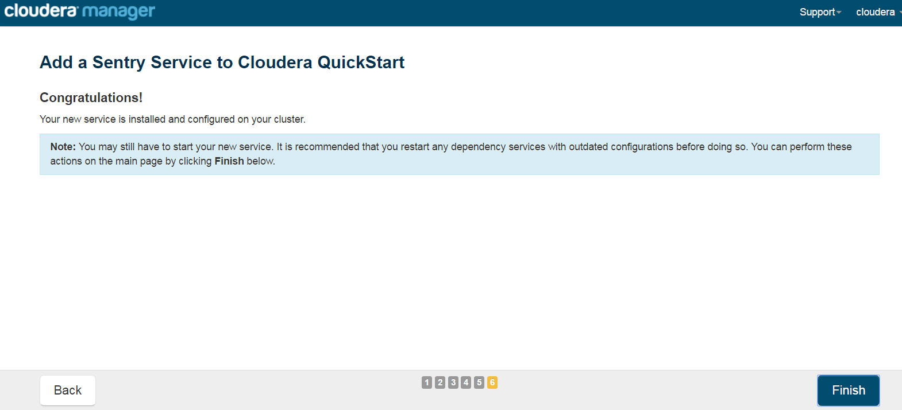

= Sentry Installation Guide
ifdef::env-github,env-browser[:outfilesuffix: .adoc]

Think Big Analytics
October 2016

:toc:
:toclevels: 2
:toc-title: Contents

== Installation Steps

*	Log in to Cloudera Manager and Click on Add Service.

* 	Select Sentry from list.

*	Select host for Sentry.

*	Provide Sentry database information and test connection.

	Database Type : mysql
	Database Name : sentry
	Username : sentry
	Password : sentry
	

*	Click on Continue once all services are started.

*	Click on Finish.

	
Sentry is insatlled successfully. 