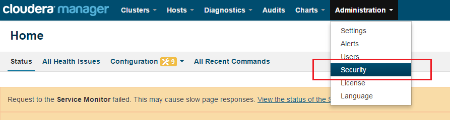
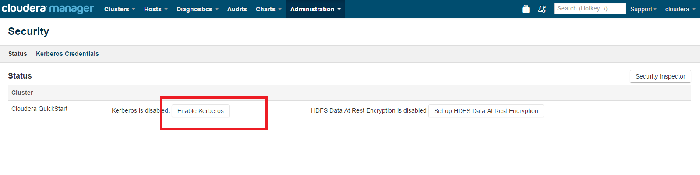
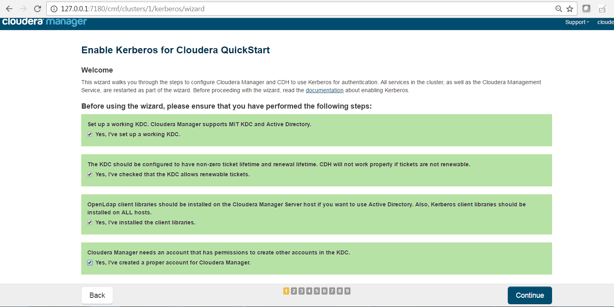
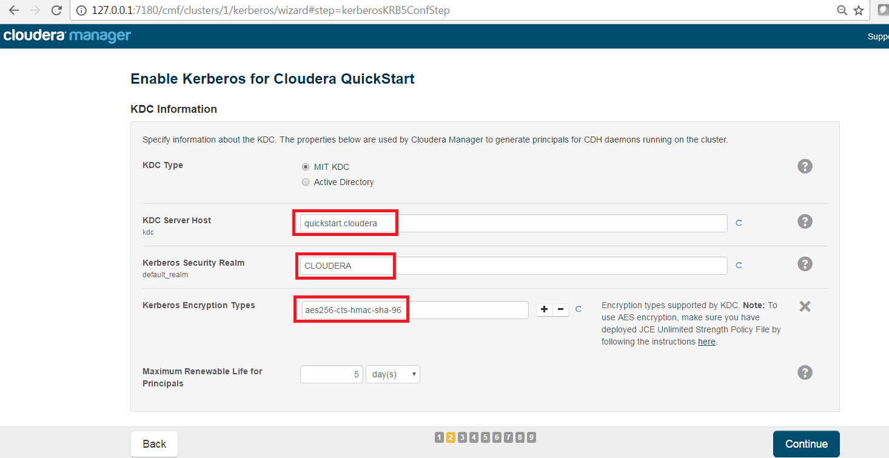
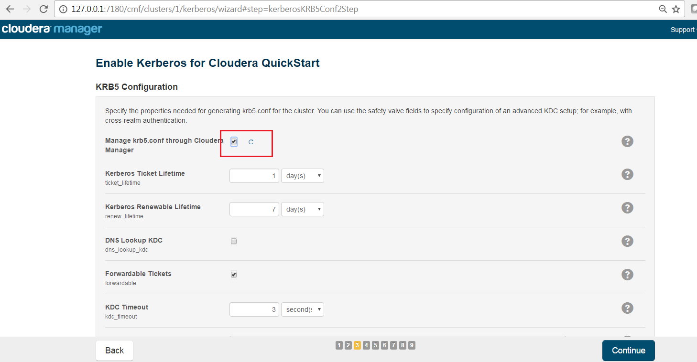
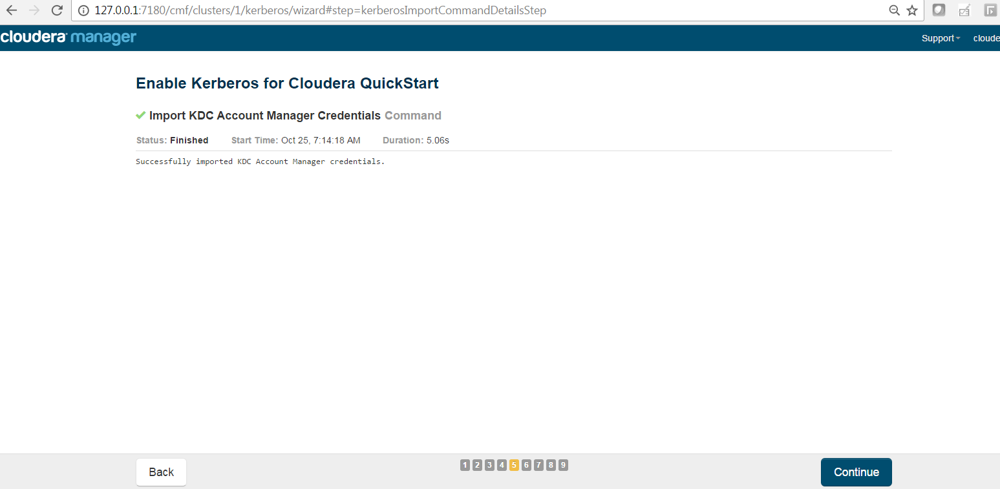
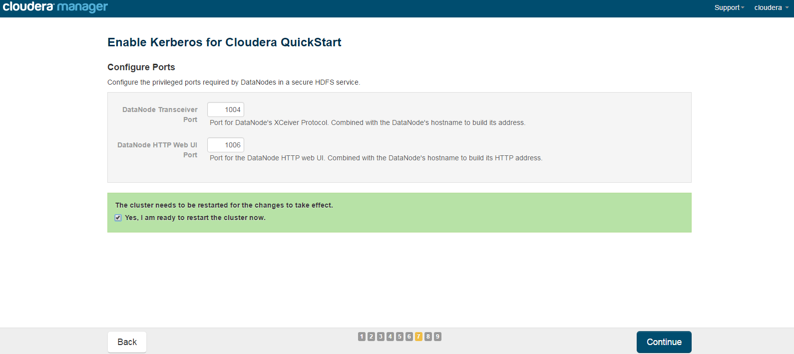

= Kerberos Installation Guide
ifdef::env-github,env-browser[:outfilesuffix: .adoc]

IMPORTANT: This document should only be used for DEV/Sandbox purposes. It is useful to help quickly Kerberize your
Cloudera sandbox so that you can test Kerberos features.

Think Big Analytics
October 2016

:toc:
:toclevels: 2
:toc-title: Contents

== Pre-requisite

=== Java 

All client node should have java installed  on it.

    $ java version "1.7.0_80"
    $ Java(TM) SE Runtime Environment (build 1.7.0_80-b15)
    $ Java HotSpot(TM) 64-Bit Server VM (build 24.80-b11, mixed mode)

    $ echo $JAVA_HOME
    $ /usr/java/jdk1.7.0_80

	
=== Install Java Cryptography Extensions (JCE) 

    sudo wget -nv --no-check-certificate --no-cookies --header "Cookie: oraclelicense=accept-securebackup-cookie" http://download.oracle.com/otn-pub/java/jce/7/UnlimitedJCEPolicyJDK7.zip -O /usr/java/jdk1.7.0_80/jre/lib/security/UnlimitedJCEPolicyJDK7.zip
	
    cd /usr/java/jdk1.7.0_80/jre/lib/security
	
    sudo unzip UnlimitedJCEPolicyJDK7.zip
	
    sudo cp UnlimitedJCEPolicy/* .
	
    #sudo rm -r UnlimitedJCEPolicy*
	
    ls -l
	
=== Test Java Cryptography Extension

	Create a java Test.java and paste below mentioned code in it.
	$ vi Test.java

	import javax.crypto.Cipher;
	class Test {
	public static void main(String[] args) {
	try {
	  System.out.println("Hello World!");
	  int maxKeyLen = Cipher.getMaxAllowedKeyLength("AES");
	  System.out.println(maxKeyLen);
	} catch (Exception e){
	  System.out.println("Sad world :(");
	}
	}
	}

	Compile:
	$ javac Test.java

	Run test, the expected number is: 2147483647

	$ java Test
	Hello World!
	2147483647
    
== Install Kerberos

On Cluser , go to master node for installation of Kerberos utils.

*	Install a new version of the KDC server: 

    yum install krb5-server krb5-libs krb5-workstation

*	Using a text editor, open the KDC server configuration file, located by default here:

    vi /etc/krb5.conf

*	Change the [realms] as below to CLOUDERA . Udapte KDC and Admin Server Information.
    
    [logging]
     default = FILE:/var/log/krb5libs.log
     kdc = FILE:/var/log/krb5kdc.log
     admin_server = FILE:/var/log/kadmind.log
    
    [libdefaults]
     default_realm = CLOUDERA
     dns_lookup_realm = false
     dns_lookup_kdc = false
     ticket_lifetime = 24h
     renew_lifetime = 7d
     forwardable = true
    
    [realms]
     CLOUDERA = {
      kdc = quickstart.cloudera
      admin_server = quickstart.cloudera
     }
            

			
4. Update /var/kerberos/krb5kdc/kdc.conf. Change the [realms] as  CLOUDERA.
    
	[kdcdefaults]
	kdc_ports = 88
	kdc_tcp_ports = 88

	[realms]
	 CLOUDERA = {
	  #master_key_type = aes256-cts
	  acl_file = /var/kerberos/krb5kdc/kadm5.acl
	  dict_file = /usr/share/dict/words
	  admin_keytab = /var/kerberos/krb5kdc/kadm5.keytab
	  supported_enctypes = aes256-cts:normal aes128-cts:normal des3-hmac-sha1:normal arcfour-hmac:normal des-hmac-sha1:normal des-cbc-md5:normal des-cbc-crc:normal
	 }

5. Update /var/kerberos/krb5kdc/kadm5.acl and replace EXAMPLE.COM with 	CLOUDERA.
	
	*/admin@CLOUDERA*
	
6. Create the Kerberos Database. Use the utility kdb5_util to create the Kerberos database. While asking for password , enter password as thinkbig. 
    
    kdb5_util create -s
	
7. Start the KDC. Start the KDC server and the KDC admin server. 

    /etc/rc.d/init.d/krb5kdc start
    /etc/rc.d/init.d/kadmin start
    
8. When installing and managing your own MIT KDC, it is very important to set
up the KDC server to auto-start on boot. 

    chkconfig krb5kdc on
    chkconfig kadmin on

9. Create a KDC admin by creating an admin principal. While asking for password , enter password as thinkbig. 

    kadmin.local -q "addprinc admin/admin"
    
10. Confirm that this admin principal has permissions in the KDC ACL. Using a text editor, open the KDC ACL file:
    
    vi /var/kerberos/krb5kdc/kadm5.acl

11. Ensure that the KDC ACL file includes an entry so to allow the admin principal to administer the KDC for your specific realm. The file should have an entry:

    */CLOUDERA*

12. After editing and saving the kadm5.acl file, you must restart the kadmin process.
    
    /etc/rc.d/init.d/kadmin restart

13. Create a user in the linux by typing below. We will use this user to test whether the Kerberos authentication is working or not. We will first run the command “hadoop fs –ls /” but switching to this user. And we will run the same command again when we enable Kerberos. 

    adduser testUser

    su testUser

    hadoop fs –ls /
	
=== Install Kerberos on Cloudera Cluster.	

*	Login to Cloudera Manager and Select Security option from Administration tab.

*	Click on Enable Kerberos. 

*	Select each item and click on continue.

*	The Kerberos Wizard needs to know the details of what the script configured. Fill in the entries as follows and click continue.

	KDC Server Host: quickstart.cloudera
	Kerberos Security Realm: CLOUDERA
	Kerberos Encryption Types: aes256-cts-hmac-sha1-96

	
*	Select checkbox Manage krb5.conf through cloudera manager.

*	Enter username and password for of KDC admin user.
	
	Username : admin/admin@CLOUDERA
	Password : thinkbig
	
*	The next screen provides good news. It lets you know that the wizard was able to successfully authenticate. 

*	Select "I’m ready to restart the cluster now" and click on continue.

*	Make sure all services started properly. Kerberos is sucessfully installed on cluster.

=== KeyTab Generation

* Create a keytab file for Nifi user.

	kadmin.local
	addprinc -randkey nifi@CLOUDERA
	xst -norandkey -k /etc/security/nifi.headless.keytab nifi@CLOUDERA
	exit
	
	chown nifi:hadoop /etc/security/keytabs/nifi.headless.keytab
	chmod 440 /etc/security/keytabs/nifi.headless.keytab

* [Optional] You can initialize your keytab file using below command.
	
	kinit -kt  /etc/security/keytabs/nifi.headless.keytab nifi
