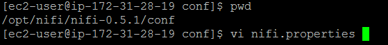
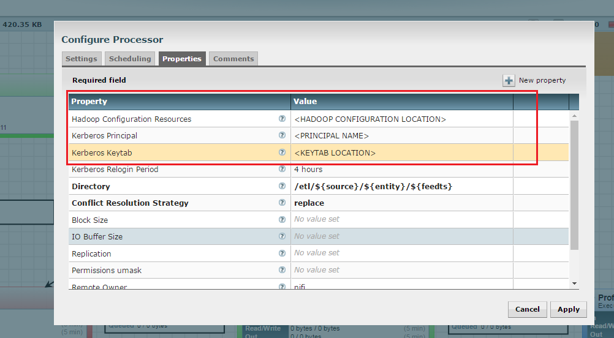

= NiFi Configuration for a Kerberos Cluster
ifdef::env-github,env-browser[:outfilesuffix: .adoc]

Think Big Analytics
June 2016

:toc:
:toclevels: 2
:toc-title: Contents

== Pre-requisites

.Below are the list of prerequisites to enable Kerberos for NiFi data lake platform.

* Running Hadoop cluster.
* NiFi should be running with latest changes.
* Kerberos should be enabled.
* Keytabs should be created and accessible.

== Type of processors to be configured:-

==== HDFS

* IngestHDFS
* CreateHDFSFolder
* PutHDFS

==== Hive

* TableRegister
* ExecuteHQLStatement
* TableMerge

==== Spark
* ExecuteSparkJob

== Configuration Steps :

*   Create a Kerberos keytab file for Nifi user

	kadmin.local
	addprinc -randkey nifi@sandbox.hortonworks.com
	xst -norandkey -k /etc/security/keytabs/nifi.headless.keytab nifi@sandbox.hortonworks.com
	exit

	chown nifi:hadoop /etc/security/keytabs/nifi.headless.keytab
	chmod 440 /etc/security/keytabs/nifi.headless.keytab

    Test that the keytab works. You can initialize your keytab file using below command.

    su - nifi
	kinit -kt  /etc/security/keytabs/nifi.headless.keytab nifi
	klist

*	Make sure nifi.properties file is available in conf directory of NiFi installed location.

*	Open nifi.properties file and set location of krb5.conf file to property nifi.kerberos.krb5.file.

    vi nifi.properties
	nifi.kerberos.krb5.file=/etc/krb5.conf

*	HDFS Processor Configuration : Log in to NiFi UI and select HDFS processor and set properties which is highlighted in red box.

    Hadoop Configuration Resource : /etc/hadoop/conf/core-site.xml,/etc/hadoop/conf/hdfs-site.xml
    Kerberos Principal: nifi
    Kerberos Keytab : /home/nifi/nifi.headless.keytab

*	SPARK Processor Configuration : Log in to NiFi UI and select HDFS processor and set properties which is highlighted in red box.

image::images/N4.png[]

*	Hive Processor Configuration : Log in to NiFi UI and go to toolbar

image::images/N5.png[]

* Go to Controller Service Tab and disable Thrift Controller Services if already running which highlighted in red box

image::images/N6.png[]

* Make sure everything has stopped properly like below.

image::images/N7.png[]

* Update HiveServer2 hostname and Hive principal name.

     Database Connection URL :<HOSTNAME>:10000/default;principal=hive/<HOSTNAME>@HDP-TBRND-DEV

image::images/N8.png[]

* Update Kerberos user information and Hadoop Configuration. Apply Changes and start controller services.

* You have successfully configured NiFi DataLake Platform with Kerberos .
